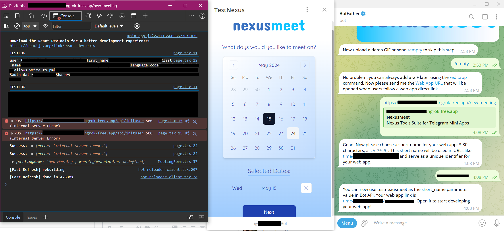

# NexusMeet

## Project Setup:
- npm i
  
  <br>
## Run Locally:
```
npm run dev
```
This runs the server on localhost:3000

<details>
    <summary>Running via Telegram Locally</summary>

### How to run the local server on telegram?
This is required for certain features that need to be tested in conjuction with the Telegram bot service. [Official documentation](https://core.telegram.org/bots/webapps#testing-mini-apps) states that you can set up a bot under test environments to use HTTP links without TLS, but I was unable to access the test environment via Telegram desktop.  


  
My workaround:   
1. Set up a new test bot using [BotFather](https://t.me/BotFather).
2. Using [ngrok](https://ngrok.com/docs/getting-started/) tunnelling services, proxy the localhost url to a public url.
3. With BotFather, set up a new miniapp linking back to your test bot using the ngrok public url.
4. Debug mode: follow the instructions in the [official documentation](https://core.telegram.org/bots/webapps#testing-mini-apps) to enable webview inspection.

</details>

<br>

## Project Structure:

This project utilises the [App Router](https://nextjs.org/docs/app/building-your-application/routing) from Next.js.  

This means that the routes are automatically set based on **folder name**.


<details>
    <summary>Why are there so many page.tsx files?</summary>
    <br>

```
src/
└── app/
    │
    ├── api/
    │   └── page.tsx
    │
    ├── pick-dates/
    │   └── page.tsx
    │
    ├── layout.tsx
    └── page.tsx
```
```page.tsx``` files contain UI that is unique to that route.  For instance, this means that frontend components in ```/new-meeting/page.tsx``` will only be reflected on the page ```localhost:3000/new-meeting/```.

Every route has its own ```page.tsx``` file. Layouts are similar to pages, except they apply to all subdirectories under it as well.

Read more about [pages and layouts](https://nextjs.org/docs/app/building-your-application/routing/pages-and-layouts).


</details>  
  
<details>
    <summary>Where are the API routes?</summary>

<br> 
 
```
src/
└── app/
    └── api/
        │
        ├── initUser/
        │   └── route.tsx
        │
        └── otherRoutes/
            └── route.tsx

```
```route.tsx``` files allows us to create custom request handlers for a given route.  For example, if we want to define our POST request for creating a user in the database, we can define it in ```/initUser/route.tsx```. We can then call the api elsewhere in our code:
```
fetch("/api/initUser", {
  method: "POST",
  headers: {"Content-Type": "application/json"},
  body: JSON.stringify({ initData: initDataRaw }),
});
```

Read more about [route handlers](https://nextjs.org/docs/app/api-reference/file-conventions/route).


</details>

<br>

## Writing API Routes:
<strong> Follow the examples of existing route.ts files. </strong> You can use ChatGPT, but it will always default to outdated code based on the previous NextJS versions.

Key Points:
- Use NextRequest and NextResponse imported from next/server
    ```
    import { NextRequest, NextResponse } from 'next/server';
    ```

- res.status needs to be in the form of a NextResponse with a JSON.stringify()

    ```
    JSON.stringify({ message: 'New user created.', user, chat_instance, chat_type, auth_date }),
        {
            status: 201,
            headers: { 'Content-Type': 'application/json' },
        }
    ```

- A named export is required for each HTTP method, or it will result in a 500 internal server error.

    ```
    export async function POST(req: NextRequest, res: NextResponse)
    ```

<br>

## Database schema:

Modify the schema in ```schema.prisma```:

  ```
  root/
  │
  ├── @/
  │
  ├── prisma/
  │   ├── migrations/
  │   └── schema.prisma
  │
  ├── public/
  └── src/
  ```
If you made changes to your schema that affect the database schema, run npx prisma migrate dev to create and apply a new migration. This also regenerates the Prisma Client to ensure it reflects the latest schema changes.  
  
```
npx prisma migrate dev
```

<strong>Note: may take up to 5 minutes for migrations to apply</strong>

<br>

## Frontend:

- [Radix UI](https://www.radix-ui.com/primitives/docs/overview/introduction)
- [shadcn](https://https://ui.shadcn.com/)

<br>

## Project Details:

<details>
    <summary>Click to expand</summary>

This is a [T3 Stack](https://create.t3.gg/) project bootstrapped with `create-t3-app`.

| Project Setup Configuration |                                    |
| --------                    | -------                            |
| Project name                | nexusmeet                          |
| Typescript or Javascript    | Typescript                         |  
| TailwindCSS                 | Yes                                |
| tRPC                        | No                                 |
| Authentication Provider     | NextAuth.js                        |
| Database ORM                | Prisma                             |
| Next.js App Router          | Yes                                |
| Database Provider           | PostgreSQL                         |
| Import aliases              | @components/* @styles/* @utils/*   |

## T3 Stack Documentation

- [Next.js](https://nextjs.org)
- [NextAuth.js](https://next-auth.js.org)
- [Prisma](https://prisma.io)
- [Tailwind CSS](https://tailwindcss.com)

## Learn More

To learn more about the [T3 Stack](https://create.t3.gg/), take a look at the following resources:

- [Documentation](https://create.t3.gg/)
- [Learn the T3 Stack](https://create.t3.gg/en/faq#what-learning-resources-are-currently-available)
- [create-t3-app GitHub repository](https://github.com/t3-oss/create-t3-app)

## Deployment

Follow the deployment guide for [Vercel](https://create.t3.gg/en/deployment/vercel) for more information.

</details>